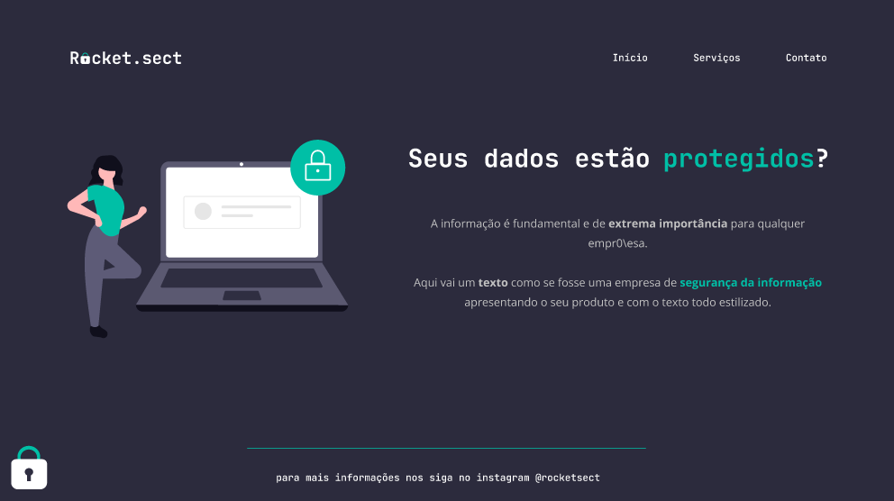

  

## 🖥️ Projeto
Esse projeto tem como tema uma empresa de segurança digital, foi desenvolvido no stage 2 do explorer da Rocketseat, onde depois de alguns aulas tivemos que desenvolver sozinhos essa página.

## 🚀 Tecnologias
Foram utilizadas as seguintes tecnologias:

- HTML
- CSS
- GIT
- GITHUB
- FIGMA

## 👁 View
Aqui você pode visualizar o layout do projeto
<a 
  href="https://www.figma.com/file/iMousosCjTnaTwN4by5SVL/Explorer-(Copy)?type=design&node-id=16-106&t=sJcgfAAdZnVD9qJ3-0">
  clique aqui
</a>
